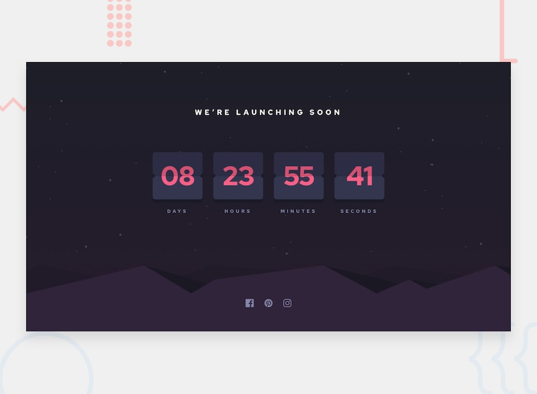
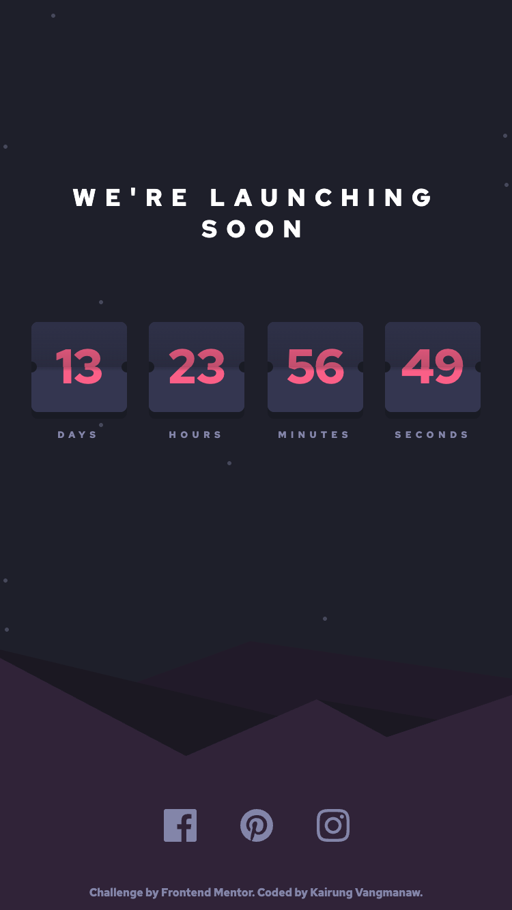
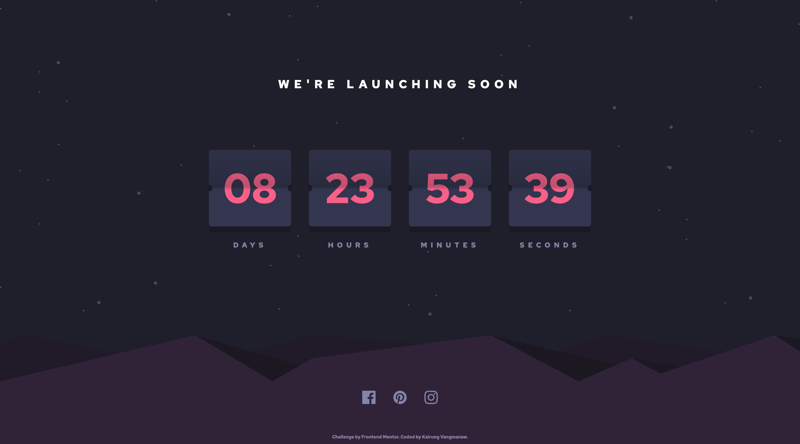
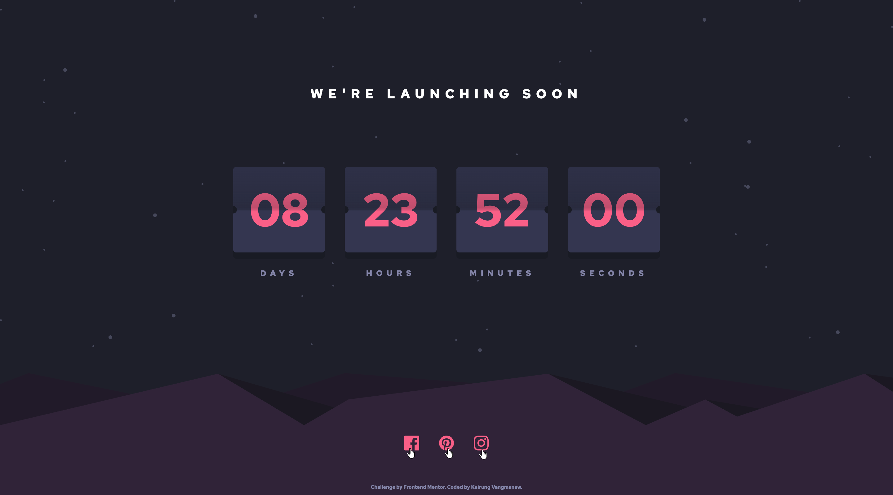

# Frontend Mentor - Launch countdown timer solution

This is a solution to the [Launch countdown timer challenge on Frontend Mentor](https://www.frontendmentor.io/challenges/launch-countdown-timer-N0XkGfyz-). Frontend Mentor challenges help you improve your coding skills by building realistic projects. 

## Table of contents

- [Frontend Mentor - Launch countdown timer solution](#frontend-mentor---launch-countdown-timer-solution)
  - [Table of contents](#table-of-contents)
  - [Overview](#overview)
    - [The challenge](#the-challenge)
    - [Screenshot](#screenshot)
    - [Links](#links)
  - [My process](#my-process)
    - [Built with](#built-with)
    - [What I learned](#what-i-learned)
    - [Continued development](#continued-development)
    - [Useful resources](#useful-resources)
    - [AI Collaboration](#ai-collaboration)
  - [Author](#author)
  - [Acknowledgments](#acknowledgments)

## Overview

### The challenge

Users should be able to:

- See hover states for all interactive elements on the page
- See a live countdown timer that ticks down every second (start the count at 14 days)
- **Bonus**: When a number changes, make the card flip from the middle

### Screenshot

  
Mobile view

  

  
Desktop view

  

  
Active state view

  

### Links

- Solution URL: [Launch Countdown Timer with React, Custom CSS & 3D Flip Animation](https://www.frontendmentor.io/solutions/launch-countdown-timer-with-react-custom-css-and-3d-flip-animation-Ssa3qCu92z)
- Live Site URL: [Frontend Mentor | Launch countdown timer](https://challenged-by-frontend-mentor.github.io/launch-countdown-timer/)

## My process

### Built with

- Semantic HTML5 markup
- CSS custom properties & BEM methodology
- Flexbox & CSS Grid
- Mobile-first workflow
- [React](https://reactjs.org/) - JS library
- [Vite](https://vitejs.dev/) - Frontend Tooling
- [SVGR](https://react-svgr.com/) - SVG to React Component transformer

### What I learned

This project provided deep insights into 3D CSS animation techniques and React state handling:

1. **3D Flip Card Animation Mechanics:** Building a clock flip animation is uniquely challenging compared to standard card-flip components. Since it splits into top and bottom halves with independent rotation axes (`transform-origin`) and distinct timing delays, getting the lighting, card overlapping, and 3D perspective (`perspective(250px)`) to look natural required precise coordination.

2. **Re-triggering CSS Animations with React Keys:** I learned the power of using the `key` prop (e.g., `key={`top-${current}`}`) in React to force element re-mounting. Rather than managing complex state toggles for CSS classes, updating the `key` cleanly triggers keyframe animations from scratch on every tick without state bugs or timing glitches.

3. **Incremental Development & Iterative Deployment:** Adopting an iterative approach made a huge difference. I built the complete layout and functional countdown timer first, deployed the base version, and then introduced the 3D flip animations step-by-step. Working without visual clutter early on drastically streamlined debugging.

4. **Handling SVGs as React Components with Vite:** Utilizing `vite-plugin-svgr` to render SVGs directly as React components was a game-changer. It allowed seamless inline access to `<svg>` properties for styling hover states and dynamic properties easily.

### Continued development

I plan to build upon this component to create a customizable launch countdown widget where users can input custom target dates and times. Beyond simple timers, this mechanism serves as a strong foundation for build-up landing pages, such as upcoming feature announcements, event launches, or promotional flash sales where time-driven anticipation is key.

### Useful resources

- [MDN - CSS perspective](https://developer.mozilla.org/en-US/docs/Web/CSS/Reference/Properties/perspective?utm_source=gemini) - This documentation was essential for understanding how the perspective property defines the distance between the user and the 3D z-plane.

- [CSS-Tricks - How CSS Perspective Works](https://css-tricks.com/how-css-perspective-works/?utm_source=gemini) - A great guide that helped me visualize camera distance and how 3D space transforms elements.

- [MDN - rotateX()](https://developer.mozilla.org/en-US/docs/Web/CSS/Reference/Values/transform-function/rotate?utm_source=gemini) - Clear explanations of axis-based rotations and the 3D coordinate system.

### AI Collaboration

Throughout this project, I collaborated with Gemini and Google Search AI Mode as thought partners. I leveraged them primarily for debugging complex 3D CSS animation timing, exploring 3D coordinate physics (like `perspective` and `rotateX`), and refactoring React animation triggers using the `key` prop pattern to keep the codebase clean and performant.

## Author

- GitHub: [Kairung Vangmanaw](https://github.com/VangmanawKairung)
- Frontend Mentor - [@VangmanawKairung](https://www.frontendmentor.io/profile/VangmanawKairung)

## Acknowledgments

I would like to express my sincere gratitude to myself for pushing through the complex 3D mechanics, and to my family for their constant support. Special thanks to the Frontend Mentor team for designing such an engaging and challenging prompt, as well as to the creators of the essential tools that made this project possible—including AI assistants, Visual Studio Code, Google Chrome, and various VS Code extensions that streamlined my development workflow. I'd also like to give a hat tip to macOS Preview; using its quick pixel measurement tool alongside my design overlays allowed me to capture exact UI dimensions swiftly without endless trial and error.
